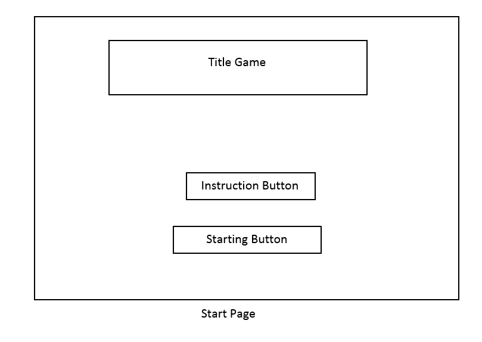
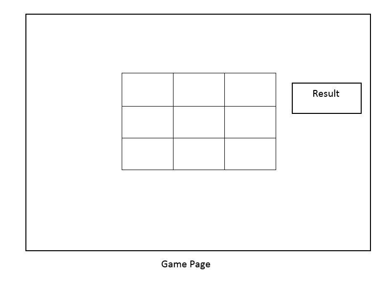

# Project Title

Tec Tac Toe Game

## Description

The game is to be played between two people (in this program between You and COMPUTER).
Computer is " O" and you "X" to mark their respective cells.
The game starts with you and the game ends when one of the players has one whole row/ column/ diagonal filled with his/her respective character ("O" or "X").

### Technical Used
HTML
CSS
JavaScript

### Wireframes
Start page

Game Page

### User Stories
 as Player,I would like instruction alert to explain how the game works
 as Player,I would like Start Button to start the Game
 as Player,I would like text to appear to tell me i have won

## Planning and Development Process

Day1: Planning How can implement the game

Day2-Day3: implementing the idea  
Day4: Designing

### Problem-Solving Strategy

I used " console.log()" to check if there is Problem in any function!

 ## References
